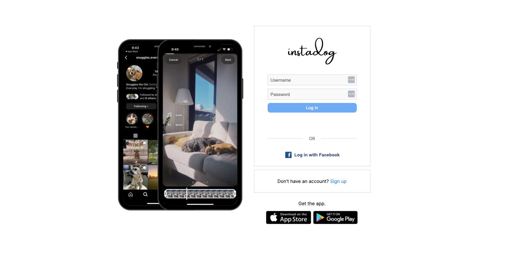

<br/>
<p align="center">
  <h1 align="center">Instadog</h1>

  <p align="center">
    A personal monorepo project named Instadog, an Instagram clone specifically for dogs!
    <br/>
    <br/>
  </p>
</p>


## About The Project


Instadog is built with <b>Next.js 13</b>, <b>GraphQL</b> APIs and <b>MongoDB</b> database.

It's a <b>monorepo</b> that combines <b>TypeScript</b> and <b>GraphQL's</b> type systems to create a <i>full-stack</i>, <i>fully-type-checked</i> codebase.

The project implements <b>Dependency Injection</b> without using <i>any</i> framework, and demonstrates <b>testability</b> with <b>unit tests</b>.

It's an ongoing project with new features and functionalities being added continuously. The end goal is to have a fully functional Instagram-cloned web app.

## Getting Started


### Prerequisites

* npm

```sh
npm install npm@latest -g
```

### Installation

1. Clone the repo

```sh
git clone https://github.com/maynggg/instadog.git
```

2. Install NPM packages

```sh
npm install
```

3. Set up local environment variables and MongoDB

```sh
cd packages/backend
cp .env.example .env 
```

Replace the `MONGO_URI` value in the `.env` file with your connection string

4. Run back-end app

```sh
cd packages/backend
npm run dev
```

The Apollo Studio Sandbox is accessible from http://localhost:4000

5. In a different terminal, run front-end app

```sh
cd packages/frontend
npm run dev
```

The app is accessible from http://localhost:3000